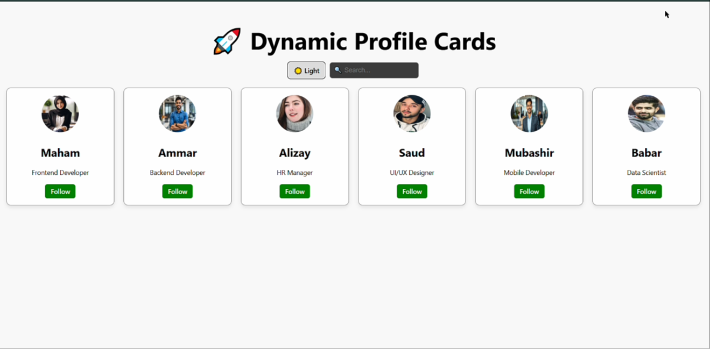
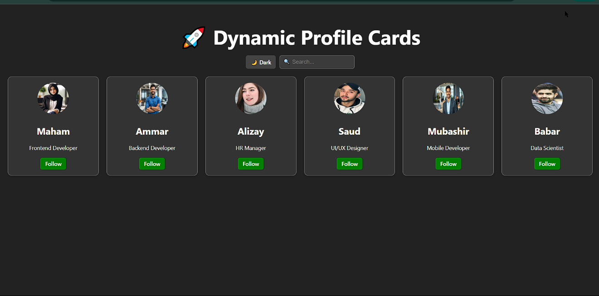

"Dynamic Profile Card"

Project Description:
This is my first React project for my internship. It demonstrates how to use props and state in React by building a dynamic profile card app.

Features:

- Display profile cards with name, bio, and picture
- Follow/Unfollow button for each user
- Light/Dark mode toggle
- Search bar to filter users by name
- Multiple cards visible on the screen at once
- Pictures stored in the assets folder (custom images)

  Live Demo: https://maham2104.github.io/dynamic-profile-card/

Screenshots:

Light Mode:

Dark Mode:

How to Run:

1. Open the project folder in CMD.  
2. Type `npm install` and press Enter.  
3. Type `npm run dev` and press Enter.  
4. Open the link that appears in your browser to see the app.

Learning:

This project helped me understand:
- How props pass data to child components
- How state makes the UI interactive and dynamic
